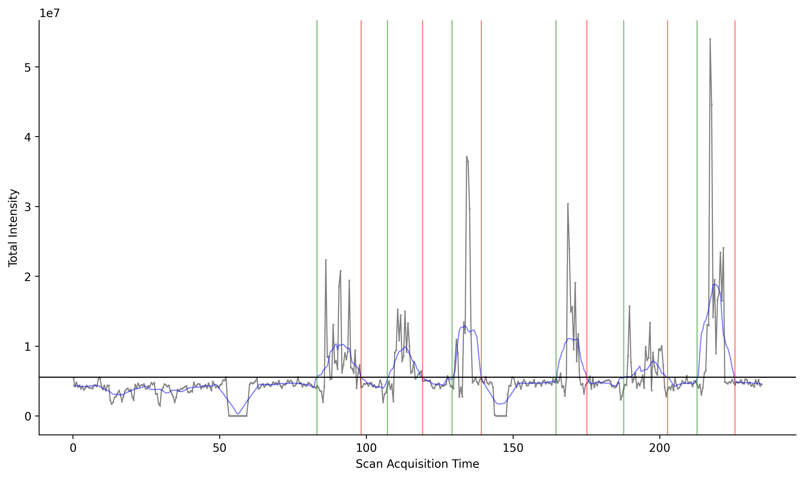

# NetCDF Intensity Splitter

A Python utility for analyzing and segmenting **NetCDF (.cdf)** files based on signal intensity.  
This tool computes a rolling mean of intensity data, determines noise thresholds, identifies signal ranges, exports those ranges as new NetCDF files, and generates a summary plot.

---

## 📦 Features

- Reads NetCDF datasets containing total intensity and acquisition time.
- Computes a **center-aligned rolling mean** for smoothing.
- Determines noise limits using:
  - Maximum intensity during the first N seconds, or
  - Mean + (factor × standard deviation).
- Detects signal ranges crossing above the noise threshold.
- Exports each range as a **separate in-memory NetCDF file** bundled into a `.zip` archive.
- Generates a **plot of total intensity** with detected ranges marked.

---

## 🧠 How It Works

1. Loads a NetCDF file (e.g., exported from GC-MS or LC-MS systems).
2. Calculates rolling mean intensity.
3. Determines a noise cutoff using either:
   - `max`: maximum intensity in the first `--noise_sec` seconds.
   - `sd`: mean + `factor × standard deviation` in that same region.
4. Identifies segments where intensity exceeds the noise limit.
5. Writes each detected range to a new `.cdf` inside a single zip file.
6. Outputs a PNG plot visualizing the results.

---

## ⚙️ Installation

### Requirements
- Python 3.9+
- Pipenv


```bash
git clone https://github.com/jj136975/NetCDF-Tools.git
cd NetCDF-Tools
pipenv install
```

---

## 🚀 Usage

```bash
cd simple_netcdf_split
python main.py \
  -i input/MethnolExtractant.cdf \
  -o output \
  -s 50 \
  -m max \
  -f 2.0 \
  -n 15
```
## Example
- **Input File**: `input/MethnolExtractant.cdf`
- **Output Directory**: `output`
- **Rolling Mean Window Size**: `50`
- **Noise Method**: `max`
- **Factor**: `2.0`
- **Noise Seconds**: `15`
- **Generated Files**:
  - `output/split_ranges.zip`: Contains segmented NetCDF files.
  - `output/intensity_plot.png`: Plot of intensity with detected ranges.

[](examples/simple_netcdf_split/output/intensity_plot.png)
